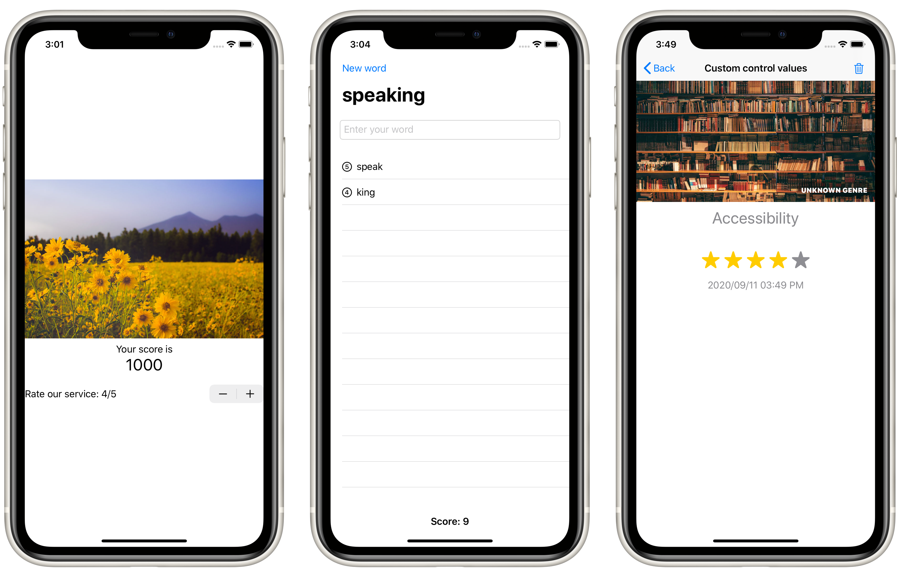

# Project 15: *Accessibility*

This technique project teaches many ways to improve accessibility (VoiceOver).

## Topics

- Identifying views with useful labels
- Hiding and grouping accessibility data
- Reading the value of controls

## Challenges

> 1. The check out view in Cupcake Corner uses an image that doesn’t add anything to the UI, so find a way to make the screen reader not read it out.
> 2. Fix the steppers in BetterRest so that they read out useful information when the user adjusts their values.
> 3. Do a full accessibility review of Moonshot – what changes do you need to make so that it’s fully accessible?

## Screenshots

