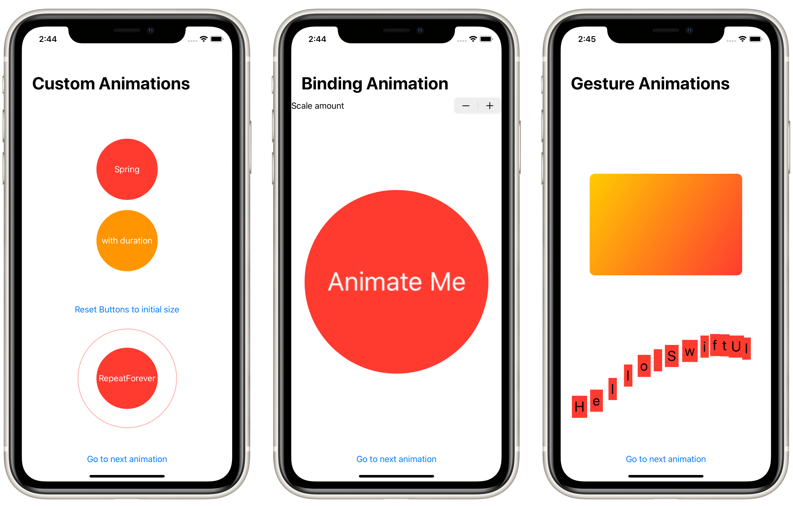

# Project 6: *Animations*

> In this technique project we’re going to look at a range of animations and transitions with SwiftUI.

## Topics

**Modifiers:** `animation`, `scaleEffect`, `rotation3DEffect`, `rotationEffect`, `offset`, `gesture`, `clipped`, `transition`  
**Other:** `Animation`, `withAnimation`, `DragGesture`

## Concepts learned through research:

- `AnyView`
- Using `_` (underscore) before variable (e.g.: `_variable`) to initialize `State` variables

## Challenges

> Go back to the Guess the Flag project and add some animation:
> 
> 1. When you tap the correct flag, make it spin around 360 degrees on the Y axis.
> 2. Make the other two buttons fade out to 25% opacity.
> 3. And if you tap on the wrong flag? Well, that’s down to you – get creative!

## Screenshots

