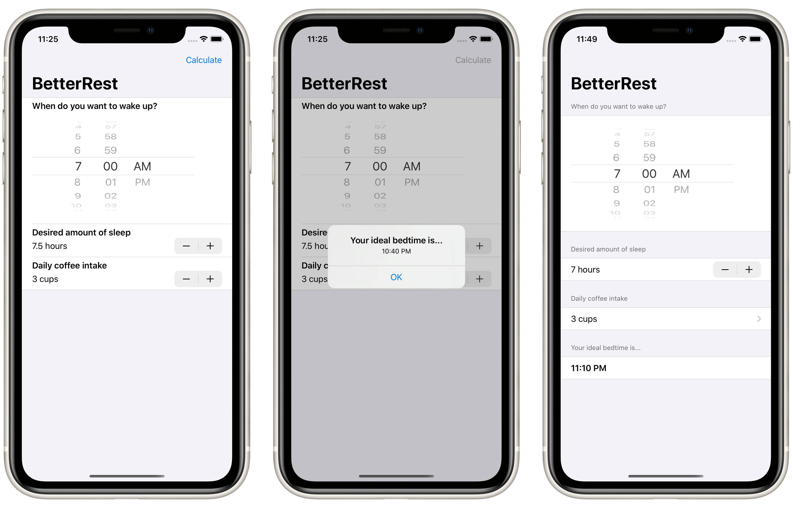

# Project 4: *BetterRest*

> The actual app we’re building is called BetterRest, and it’s designed to help coffee drinkers get a good night’s sleep by asking them three questions:
> 
> 1. When do they want to wake up?
> 2. Roughly how many hours of sleep do they want?
> 3. How many cups of coffee do they drink per day?
> 
> Once we have those three values, we’ll feed them into Core ML to get a result telling us when they ought to go to bed.

## Topics

Views: `DatePicker`, `Stepper`  
Modifiers: `navigationBarItems`  
Machie Learning (`CoreML`, and`CreateML`)  
`Date`, `DateFormatter`, `DateComponents`

## Challenges

> 1. Replace each `VStack` in our form with a `Section`, where the text view is the title of the section. Do you prefer this layout or the `VStack` layout? It’s your app – you choose!
> 
> 2. Replace the “Number of cups” stepper with a `Picker` showing the same range of values.
> 
> 3. Change the user interface so that it always shows their recommended bedtime using a nice and large font. You should be able to remove the “Calculate” button entirely.

## Screenshots

