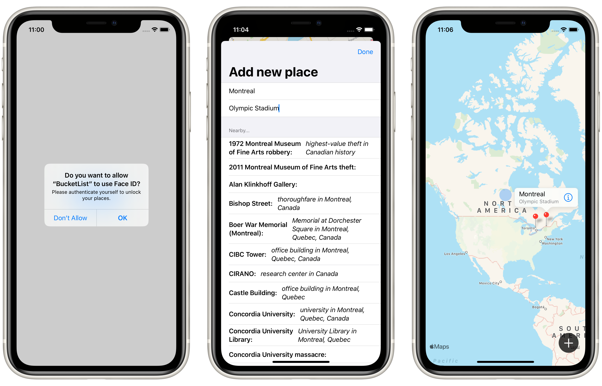

# Project 14: *BucketList*

> An app that lets the user build a private list of places on the map that they intend to visit one day, add a description for that place, look up interesting places that are nearby, and save it all to the iOS storage for later.

## Topics

- Writing data to the Documents directory using `FileManager`
- MapKit (`MKMapView`, `MKPinAnnotationView`)
- Biometrics authentication (Touch ID and Face ID) using `LocalAuthentication`
- Adding `Comparable` conformance to custom types

## Challenges

> 1. Our + button is rather hard to tap. Try moving all its modifiers to the image inside the button – what difference does it make, and can you think why?
> 2. Having a complex `if` condition in the middle of `ContentView` isn’t easy to read – can you rewrite it so that the `MapView`, `Circle`, and `Button` are part of their own view? This might take more work than you think!
> 3. Our app silently fails when errors occur during biometric authentication. Add code to show those errors in an alert, but be careful: you can only add one `alert()` modifier to each view.

## Screenshots

