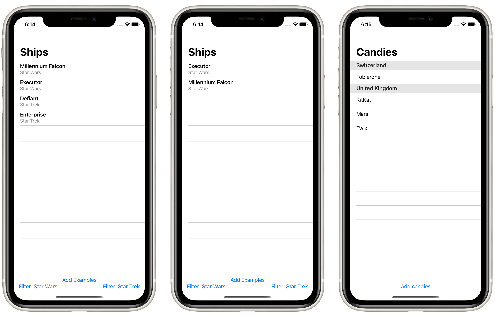

# Project 12: *CoreDataProject*

This technique project explores Core Data in more detail.

## Topics

- Entity codegen (Manual / Class / Category), constraints, relationships
- `NSPredicate`, `NSMergePolicy`

## Challenges

> 1. Make it accept an array of `NSSortDescriptor` objects to get used in its fetch request.
> 2. Make it accept a string parameter that controls which predicate is applied. You can use Swift’s string interpolation to place this in the predicate.
> 3. Modify the predicate string parameter to be an enum such as `.beginsWith`, then make that enum get resolved to a string inside the initializer.

## Screenshots

