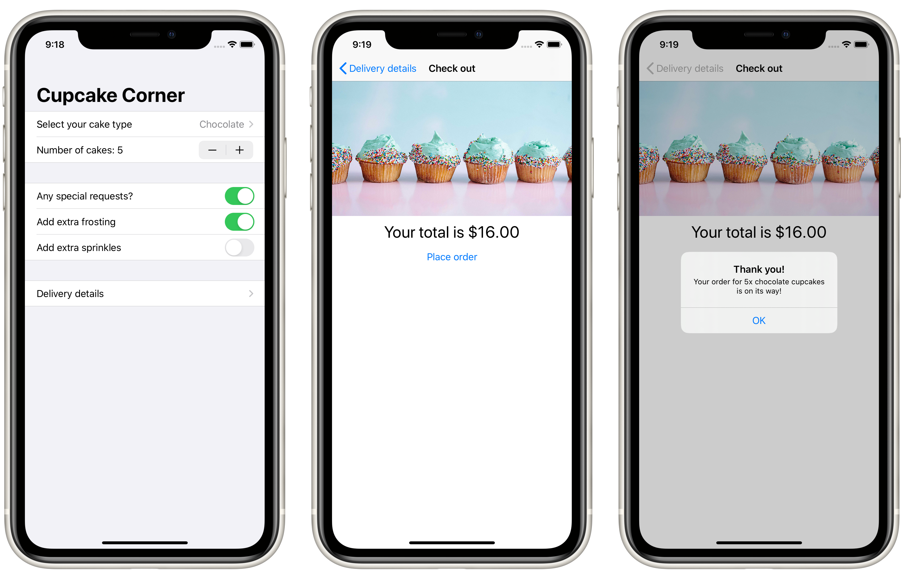

# Project 10: *CupcakeCorner*

A multi-screen app for ordering cupcakes.

## Topics

- Manually Encoding and Decoding an `ObservableObject` using `CodingKey`
- Networking using `URLRequest` and `URLSession`

## Challenges

> 1. Our address fields are currently considered valid if they contain anything, even if it’s just only whitespace. Improve the validation to make sure a string of pure whitespace is invalid.
> 2. If our call to `placeOrder()` fails – for example if there is no internet connection – show an informative alert for the user. To test this, just disable WiFi on your Mac so the simulator has no connection either.
> 3. For a more challenging task, see if you can convert our data model from a class to a struct, then create an `ObservableObject` class wrapper around it that gets passed around. This will result in your class having one `@Published` property, which is the data struct inside it, and should make supporting `Codable` on the struct much easier.

## Screenshots

