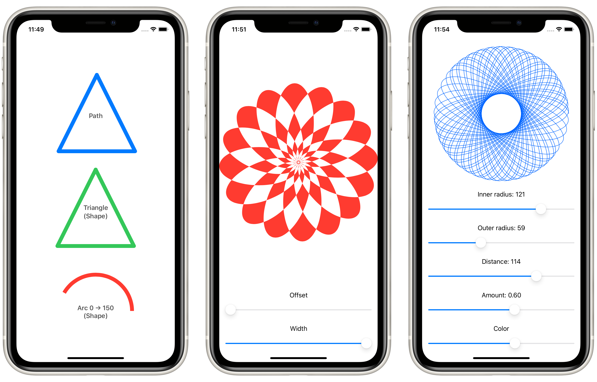

# Project 9: *Drawing*

> In this technique project we’re going to take a close look at drawing in SwiftUI, including creating custom paths and shapes, animating your changes, solving performance problems, and more.

## Topics

**Views:** `Path`, `Shape`, `InsettableShape`  
**ViewModifiers:** `strokeBorder`, `drawingGroup`, `blendMode`, `colorMultiply`, `saturation`  
**Other:** `StrokeStyle`, `CGAffineTransform`, `ImagePaint`, `animatableData`, `AnimatablePair`

## Challenges

> 1. Create an `Arrow` shape made from a rectangle and a triangle – having it point straight up is fine.
> 2. Make the line thickness of your `Arrow` shape animatable.
> 3. Create a `ColorCyclingRectangle` shape that is the rectangular cousin of `ColorCyclingCircle`, allowing us to control the position of the gradient using a property.

## Screenshots

