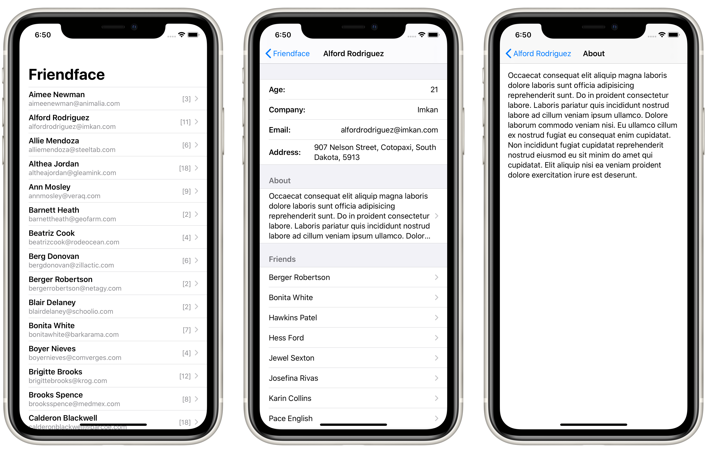

# Milestone 4: *Friendface*

> Your job is to use `URLSession` to download some JSON from the internet, use `Codable` to convert it to Swift types, then use `NavigationView`, `List`, and more to display it to the user.
>
> How far you implement this is down to you, but at the very least you should:
> - Fetch the data and parse it into `User` and `Friend` structs.
> - Display a list of users with a little information about them.
> - Create a detail view shown when a user is tapped, presenting more information about them.

## Topics

Applies concepts learned in Projects 10-12

## Concepts learned through research:

- How to decode JSON as a `NSManagedObject` object by passing the `NSManagedObjectContext` in the `userInfo` property of `Decoder`

## Screenshots

