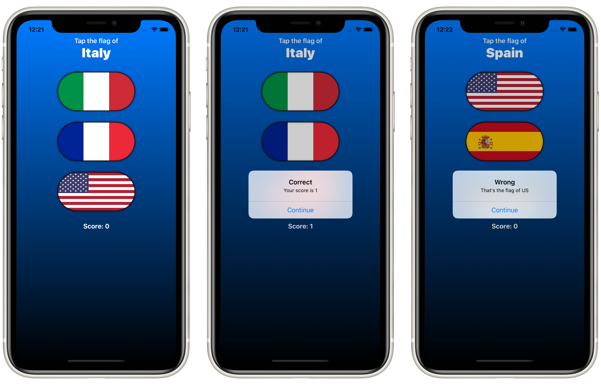

# Project 2: *GuessTheFlag*

A game that shows a list of flags and a country name. The user has guess which flag belongs to the country name shown.

## Topics

**Views:** `HStack`, `VStack`, `ZStack`, `Spacer`, `Image`, `Button`, `Alert`, `Color`, `LinearGradient`, `RadialGradient`, `AngularGradient`

## Screenshots

