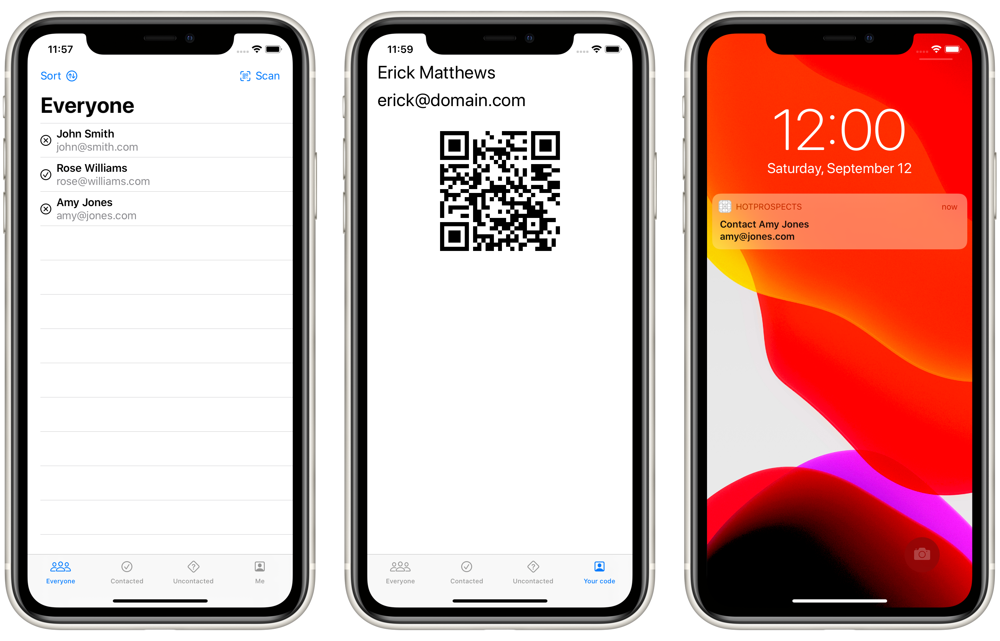

# Project 16: *HotProspects*

An app to track who you meet at conferences. It will show a QR code that stores your attendee information, then others can scan that code to add you to their list of possible leads for later follow up.

## Topics

- Creating Tab bars using `TabView`
- Context menus
- Sharing data between views with `EnvironmentObject`
- Local notifications

## Challenges

> 1. Add an icon to the “Everyone” screen showing whether a prospect was contacted or not.
> 2. Use JSON and the documents directory for saving and loading our user data.
> 3. Use an action sheet to customize the way users are sorted in each screen – by name or by most recent.

## Screenshots

