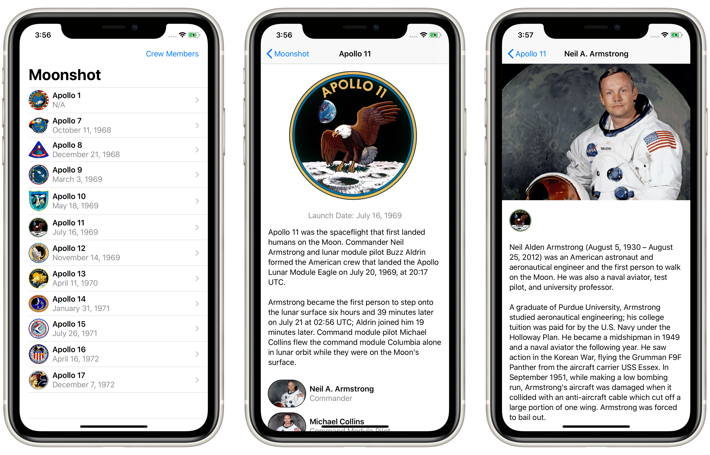

# Project 8: *Moonshot*

An app that lets users learn about the missions and astronauts that formed NASA’s Apollo space program.

## Topics

**Views:** `GeometryReader`, `ScrollView`, `NavigationLink`  
**ViewModiers:** `resizable`, `scaledToFit`, `buttonStyle`, `layoutPriority`

## Challenges

> 1. Add the launch date to `MissionView`, below the mission badge.
> 2. Modify `AstronautView` to show all the missions this astronaut flew on.
> 3. Make a bar button in `ContentView` that toggles between showing launch dates and showing crew names.

## Screenshots

