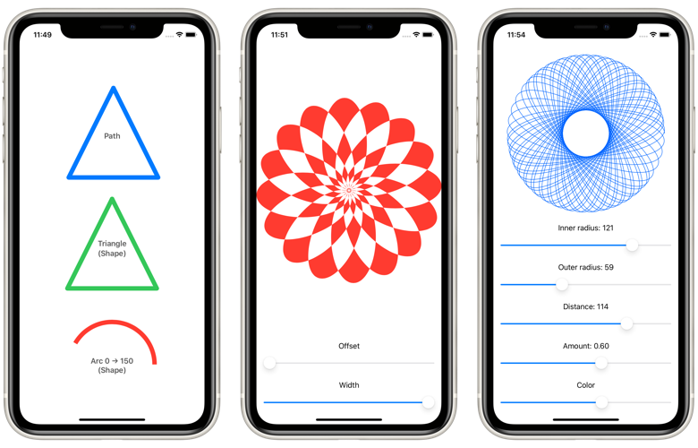

# 100DaysOfSwiftUI

Projects from the [100 Days of SwiftUI](https://www.hackingwithswift.com/100/swiftui) course by Paul Hudson ([@twostraws](https://github.com/twostraws))

The course is divided into `Projects` and `Milestones`. `Projects` are meant to teach iOS cocepts, techniques and frameworks.
**Every 3 projects**, a milestone is reached. `Milestones` are challenges that use the concepts learned in the previous 3 projects. For example, after `Project 3` comes `Milestone 1`.

## Course Content

| Projects & Topics | Screenshots |
| -----------------  | :---------: |
| **Project 1:** *[WeSplit](WeSplit)* _Structure of SwiftUI projects **Protocols:** `View`, and `PreviewProvider` **Views:** `NavigationView`, `Form`, `Group`, `Section`, `Text`, `TextField`, `Picker`, and `ForEach` **Property Wrapper:** `@State` and `$` prefix operator for binding  **Concepts learned through research:** – `HStack`, and `Spacer` views_   |  |
| **Challenge day:** *[UnitConverter](UnitConverter)* _**Concepts learned through research:** – The `id` parameter of `ForEach` to identify each element in the collection uniquely – The `Binding` property wrapper to provide a custom setter and getter to the Picker view – `Button` view_ |  |
| **Project 2:** *[GuessTheFlag](GuessTheFlag)* _**Views:** `HStack`, `VStack`, `ZStack`, `Spacer`, `Image`, `Button`, `Alert`, `Color`, `LinearGradient`, `RadialGradient`, `AngularGradient`_   |  |
| **Project 3:** *[ViewsAndModifiers](ViewsAndModifiers)* _(Technique Project)  – Fundamentals of `Views`, and `ViewModifiers` – Conditional modifiers – Environment modifiers – View composition – Custom modifiers – Custom containers using `@ViewBuilder` and `@escaping` closure_ |  |
| **Milestone 1:** *[RockPaperScissors](RockPaperScissors)* _Applies concepts learned in Projects 1-3_ |  |
| **Project 4:** *[BetterRest](BetterRest)* _**Views:** `DatePicker`, `Stepper` **Modifiers:** `navigationBarItems()` Machie Learning (`CoreML`, and `CreateML`) `Date`, `DateFormatter`, `DateComponents`_ |  |
| **Project 5:** *[WordScramble](WordScramble)* _**Views:** `List` **Modifiers:** `onAppear()` `Bundle`, `fatalError()`, `UITextChecker`_ |  |
| **Project 6:** *[Animations](Animations)* _(Technique Project)  **Modifiers:** `animation`, `scaleEffect`, `rotation3DEffect`, `rotationEffect`, `offset`, `gesture`, `clipped`, `transition` **Other:** `Animation`, `withAnimation`, `DragGesture`  **Concepts learned through research:** – `AnyView` – Using `_` (underscore) before variable (e.g.: `_variable`) to initialize `State` variables_ |  |
| **Milestone 2:** *[MultiplicationTables](MultiplicationTables)* _Applies concepts learned in Projects 4-6  **Concepts learned through research:** –The `GeometryReader` view to set frame sizes as a percentage of the screen – The `sheet` view modifier to show another view modally – The `UIViewRepresentable` protocol to wrap UIKit views and show them in SwiftUI_ |  |
| **Project 7:** *[iExpense](iExpense)* _**Property Wrappers:** `@ObservedObject`, `@Published`, `@Environment(\.presentationMode)` **ViewModifiers:** `sheet()`, `onDelete()` **Other:** `Identifiable`, `ObservableObject`, `UserDefaults`, `Codable`_ |  |
| **Project 8:** *[Moonshot](Moonshot)* _**Views:** `GeometryReader`, `ScrollView`, `NavigationLink` **ViewModiers:** `resizable`, `scaledToFit`, `buttonStyle`, `layoutPriority`_ |  |
| **Project 9:** *[Drawing](Drawing)* _(Technique Project)  **Views:** `Path`, `Shape`, `InsettableShape` **ViewModifiers:** `strokeBorder`, `drawingGroup`, `blendMode`, `colorMultiply`, `saturation` **Other:** `StrokeStyle`, `CGAffineTransform`, `ImagePaint`, `animatableData`, `AnimatablePair`_ |  |
| **Milestone 3:** *[HabitTracker](HabitTracker)* _Applies concepts learned in Projects 7-9_ |  |
| **Project 10:** *[CupcakeCorner](CupcakeCorner)* _– Manually Encoding and Decoding an `ObservableObject` using `CodingKey` – Networking using `URLRequest` and `URLSession`_ |  |
| **Project 11:** *[Bookworm](Bookworm)* _**Property Wrappers:** `@FetchRequest`, `@Environment(\.horizontalSizeClass)` **Views:** `AnyView` **Other:** `Core Data` (`NSManagedObject`, `NSManagedObjectContext`, `NSSortDescriptor`)_ |  |
| **Project 12:** *[CoreDataProject](CoreDataProject)* _(Technique Project)  Entity codegen (Manual / Class / Category), constraints, relationships `NSPredicate`, `NSMergePolicy`_ |  |
| **Milestone 4:** *[Friendface](Friendface)* _Applies concepts learned in Projects 10-12_  **Concepts learned through research:** – How to decode JSON as a `NSManagedObject` object by passing the `NSManagedObjectContext` in the `userInfo` property of `Decoder` |  |
| **Project 13:** *[Instafilter](Instafilter)* _– CoreImage Framework: `CIFilter`, `CIContext` – Conversion between: `CIImage`, `CGImage` and `UIImage` – How to integrate UIKit in SwiftUI by using `UIViewControllerRepresentable` – How to pick an image: `UIImagePickerController`, `UIImagePickerControllerDelegate` – `ActionSheet` and Custom Bindings_ |  |
| **Project 14:** *[BucketList](BucketList)* _– Writing data to the Documents directory using `FileManager` – MapKit (`MKMapView`, `MKPinAnnotationView`) – Biometrics authentication (Touch ID and Face ID) using `LocalAuthentication` – Adding `Comparable` conformance to custom types_ |  |
| **Project 15:** *[Accessibility](Accessibility)* _(Technique Project)  – Identifying views with useful labels – Hiding and grouping accessibility data – Reading the value of controls_ |  |
| **Milestone 5:** *[MeetupContacts](MeetupContacts)* _Applies concepts learned in Projects 13-15_   |  |