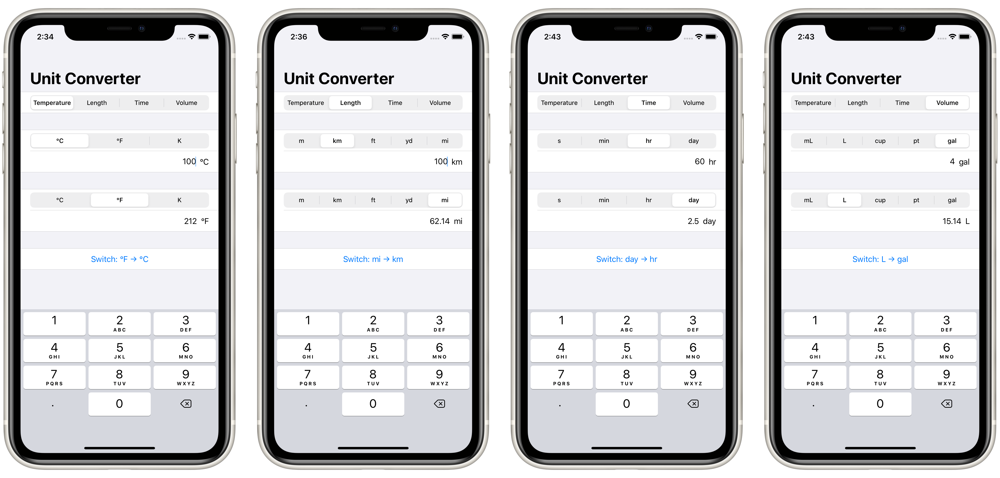

# Challenge day: *UnitConverter*

> You need to build an app that handles unit conversions: users will select an input unit and an output unit, then enter a value, and see the output of the conversion.
> 
> Which units you choose are down to you, but you could choose one of these:
> - Temperature conversion: users choose Celsius, Fahrenheit, or Kelvin.
> - Length conversion: users choose meters, kilometers, feet, yards, or miles.
> - Time conversion: users choose seconds, minutes, hours, or days.
> - Volume conversion: users choose milliliters, liters, cups, pints, or gallons.

## Concepts learned through research

- The `id` parameter of `ForEach` to identify each element in the collection uniquely
- The `Binding` property wrapper to provide a custom setter and getter to the Picker view
- `Button` view

## Screenshots

