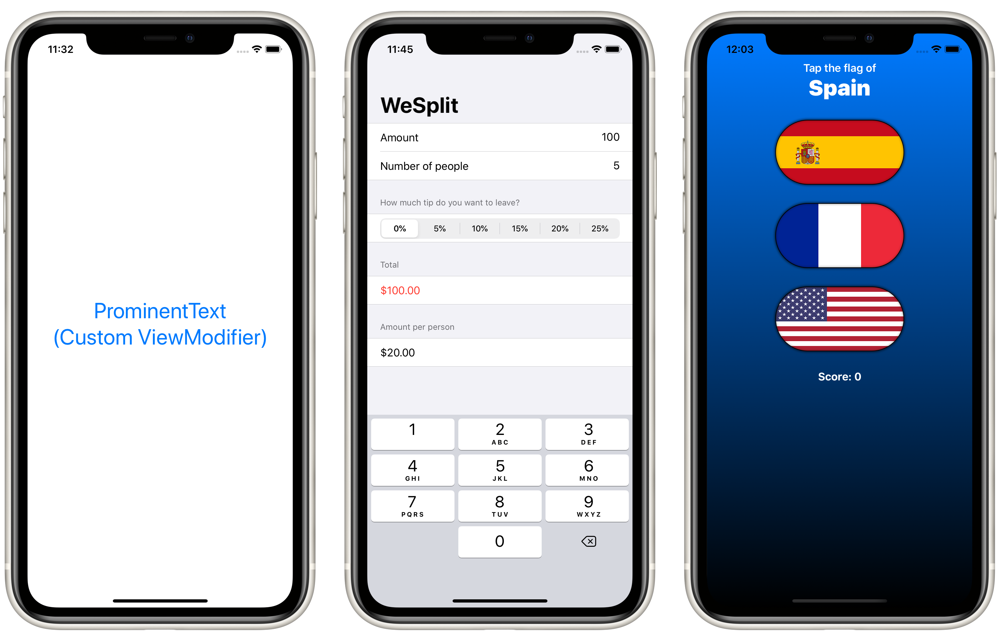

# Project 3: *ViewsAndModifiers* (Technique project)

This project dives deep into the fundamental building blocks of any SwiftUI app: Views and Modifiers. It explains why SwiftUI uses structs for views, why `some View` is so useful, how modifier order matters, and much more.

## Topics

- Why does SwiftUI use structs for views?
- What is behind the main SwiftUI view?
- Why modifier order matters
- Why does SwiftUI use `some View` for its view type?
- Conditional modifiers
- Environment modifiers
- Views as properties
- View composition
- Custom modifiers
- Custom containers

## Challenges

> 1. Create a custom `ViewModifier` (and accompanying `View` extension) that makes a view have a large, blue font suitable for prominent titles in a view.
> 
> 2. Go back to project 1 and use a conditional modifier to change the total amount text view to red if the user selects a 0% tip.
> 
> 3. Go back to project 2 and create a `FlagImage()` view that renders one flag image using the specific set of modifiers we had.

## Screenshots

