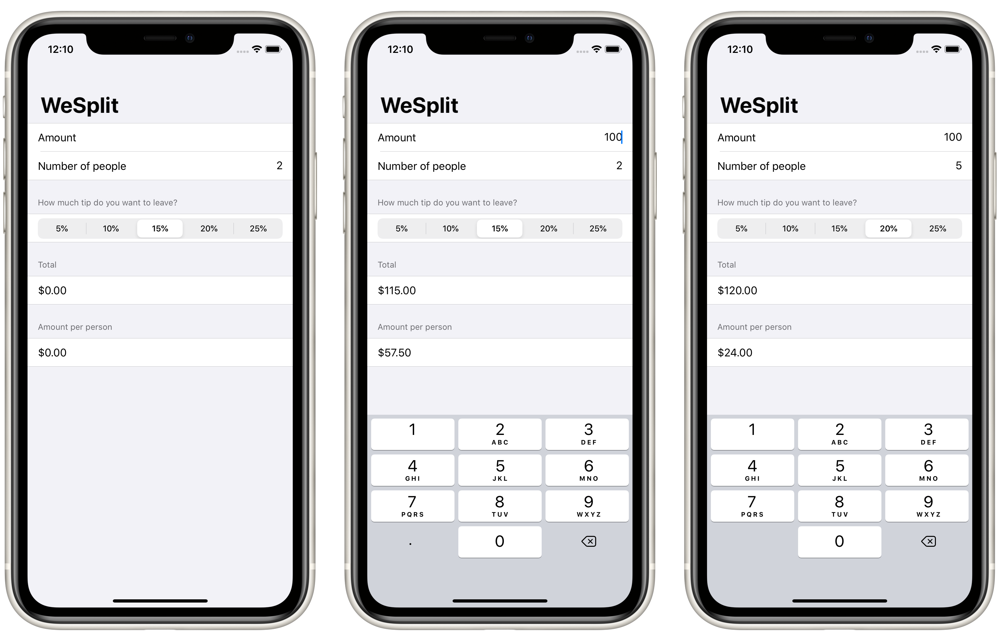

# Project 1: *WeSplit*

A check-sharing app that calculates how to split a check based on the number of people and how much tip you want to leave.

## Topics

Structure of SwiftUI projects
**Protocols:** `View`, and `PreviewProvider`
**Views:** `NavigationView`, `Form`, `Group`, `Section`, `Text`, `TextField`, `Picker`, and `ForEach`
**Property Wrapper:** `@State` and `$` prefix operator for binding

## Concepts learned through research:

- `HStack`, and `Spacer` views

## Screenshots

