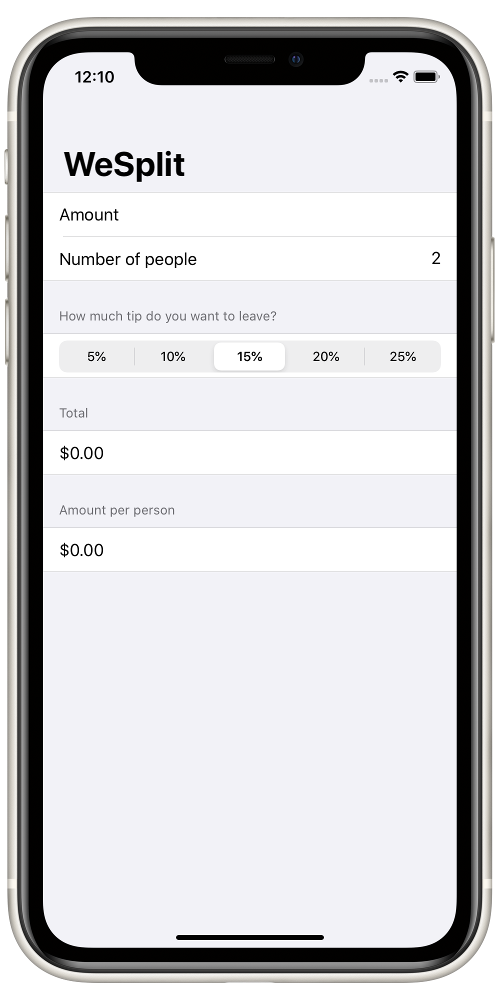
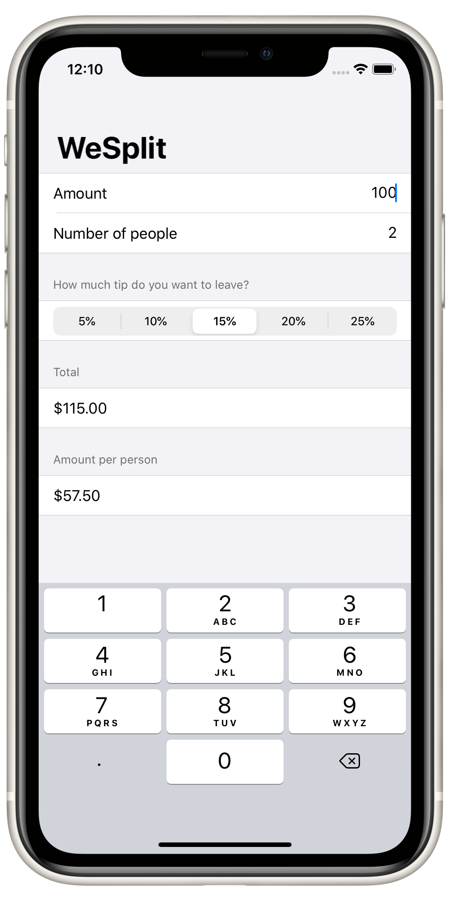
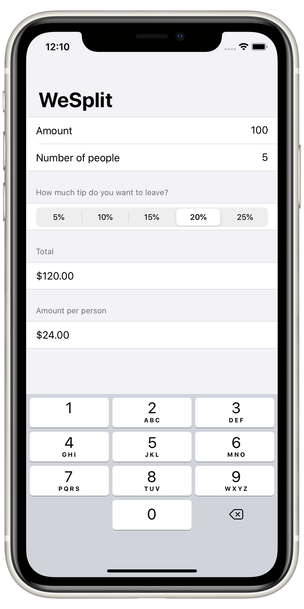

# Project 1: *WeSplit*

## Topics
*Structure of SwiftUI projects  
Protocols: `View`, and `PreviewProvider`  
Structs: `NavigationView`, `Form`, `Section`, `Text`, `TextField`, `Picker`, and `ForEach`  
Property Wrapper: `@State` and `$` prefix operator for binding*

## Screenshots

