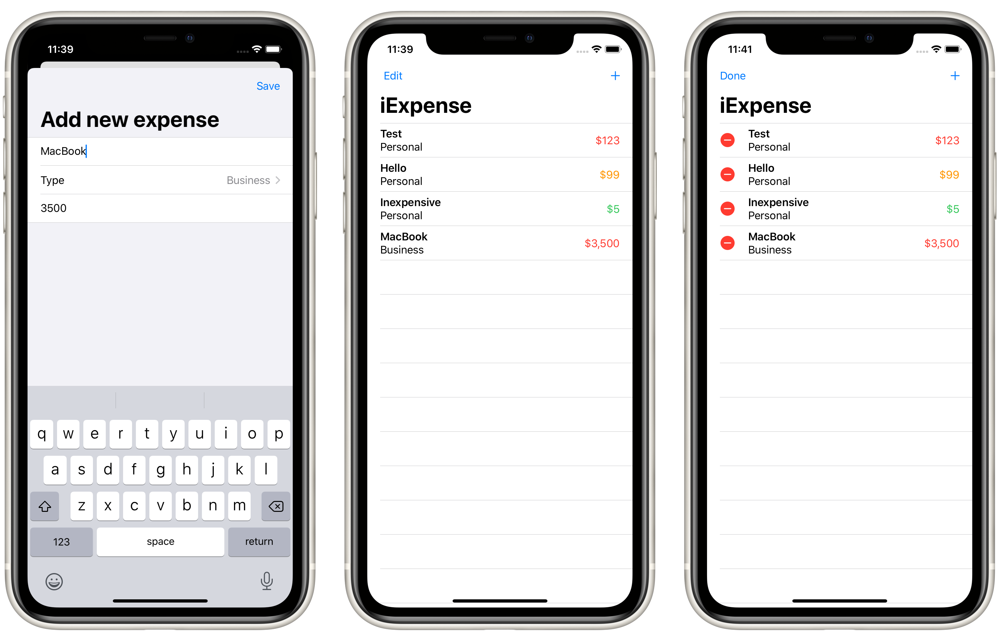

# Project 7: *iExpense*

An expenses tracking app.

## Topics

**Property Wrappers:** `@ObservedObject`, `@Published`, `@Environment`  
**ViewModifiers:** `sheet()`, `onDelete()`  
**Other:** `Identifiable`, `ObservableObject`, `UserDefaults`, `Codable`

## Challenges

> 1. Add an Edit/Done button to `ContentView` so users can delete rows more easily.
> 2. Modify the expense amounts in `ContentView` to contain some styling depending on their value – expenses under $10 should have one style, expenses under $100 another, and expenses over $100 a third style. What those styles are depend on you.
> 3. Add some validation to the Save button in `AddView`. If you enter “fish” or another thing that can’t be converted to an integer, show an alert telling users what the problem is.

## Screenshots

